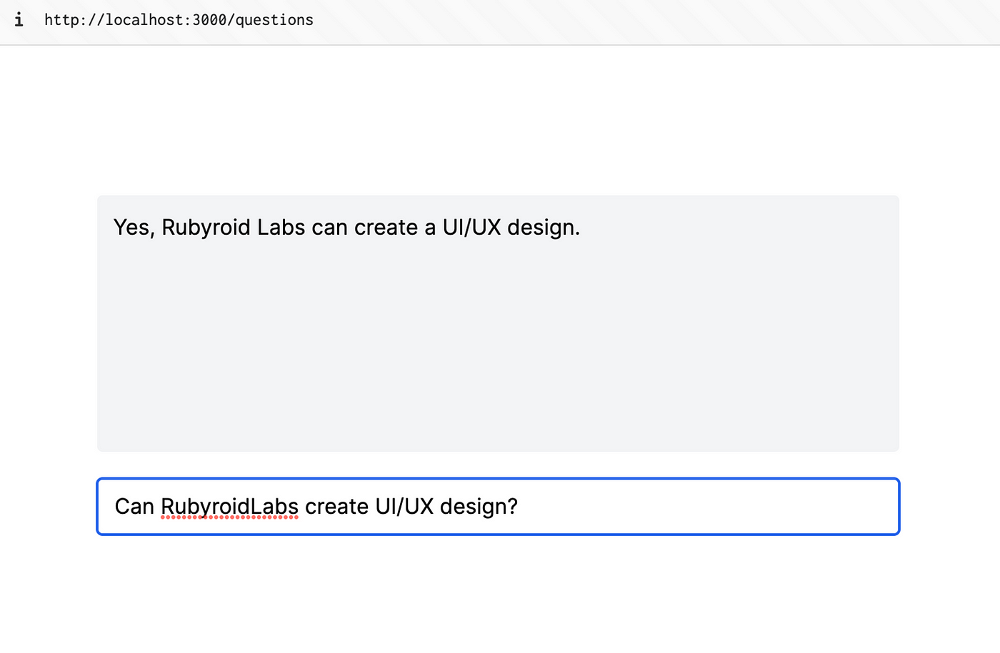
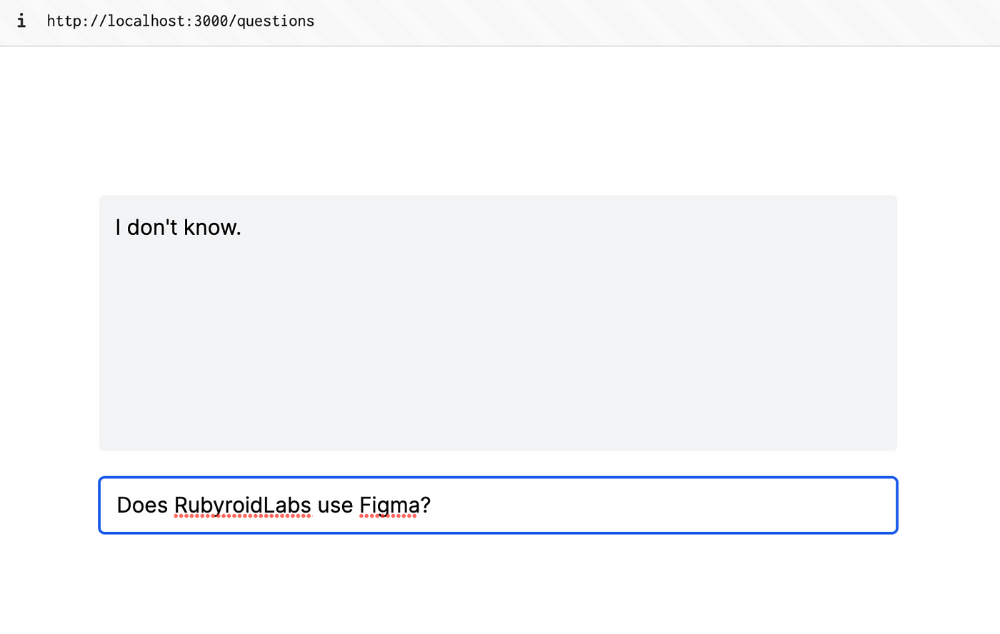
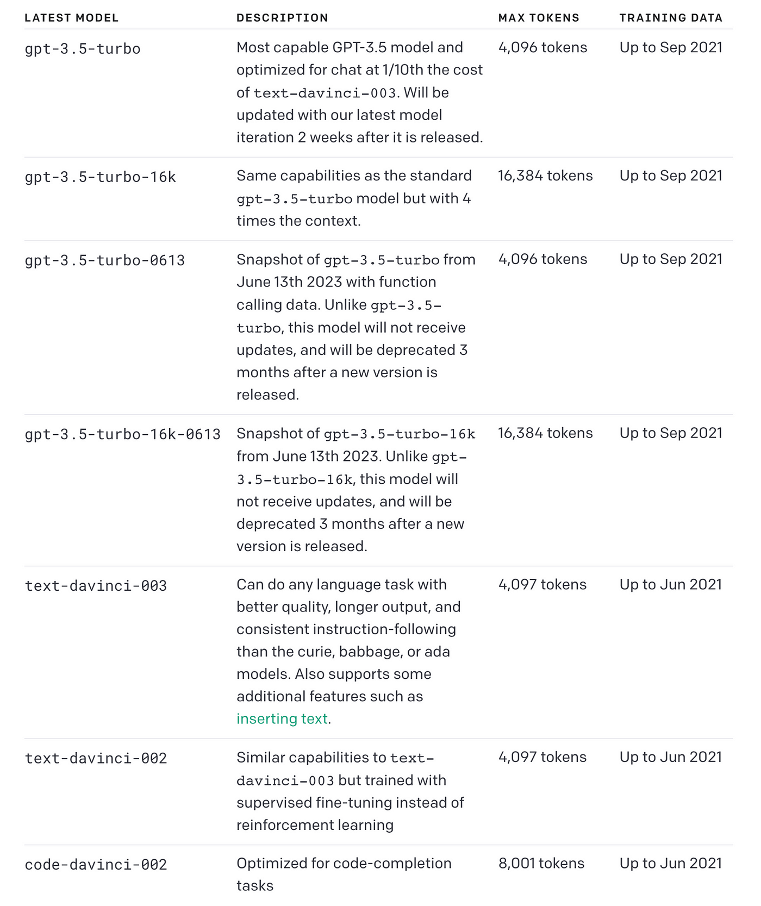
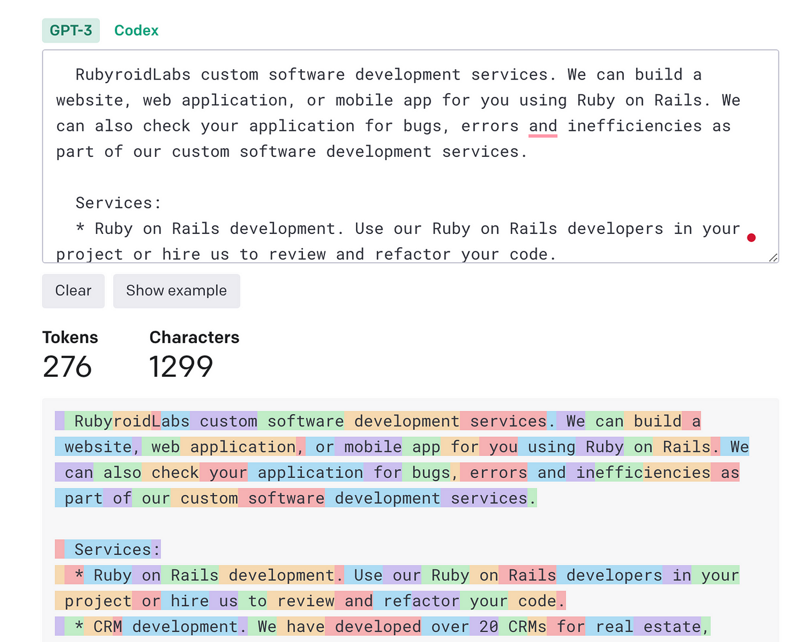
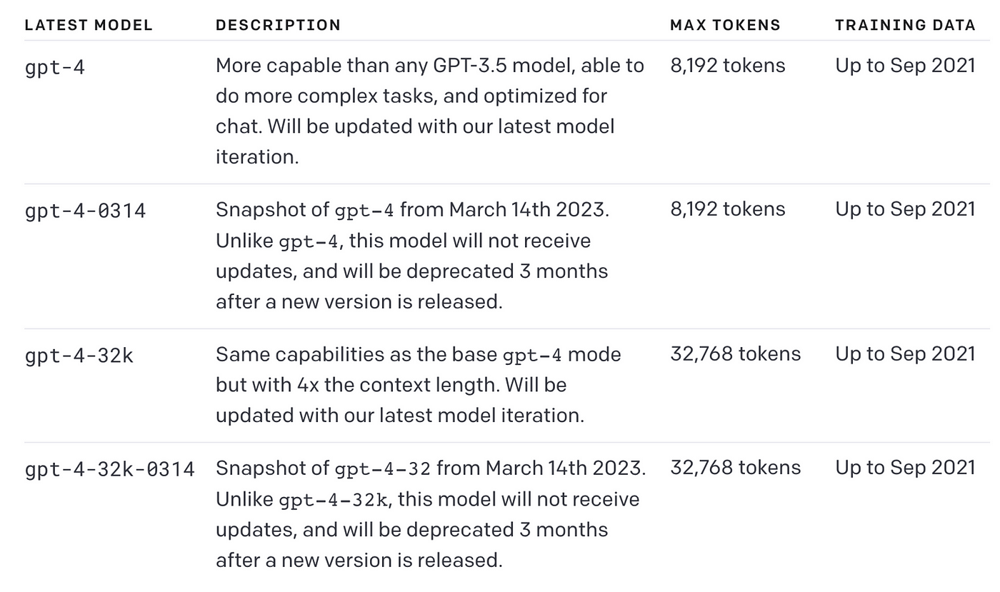

# Prototype

## Chat API

Let’s start with the simplest and the most obvious implementation — provide all our data to ChatGPT and ask it to base its answer only on the provided data. The trick here is “say ‘I don’t know’ if the question can’t be answered based on the context.”

Create a class in `app/services/chat_api_service.rb` with a `call` method and add the following code:
```ruby
# app/services/chat_api_service.rb
class ChatApiService
  def self.call(question)
    return 'Please ask a question' if question.blank?

    # So let’s copy all data from the [services](https://rubyroidlabs.com/services) page and attach it as a context.

    context = <<~LONGTEXT
      RubyroidLabs custom software development services. We can build a website, web application, or mobile app for you using Ruby on Rails. We can also check your application for bugs, errors and inefficiencies as part of our custom software development services.

      Services:
      * Ruby on Rails development. Use our Ruby on Rails developers in your project or hire us to review and refactor your code.
      * CRM development. We have developed over 20 CRMs for real estate, automotive, energy and travel companies.
      * Mobile development. We can build a mobile app for you that works fast, looks great, complies with regulations and drives your business.
      * Dedicated developers. Rubyroid Labs can boost your team with dedicated developers mature in Ruby on Rails and React Native, UX/UI designers, and QA engineers.
      * UX/UI design. Rubyroid Labs can create an interface that will engage your users and help them get the most out of your application.
      * Real estate development. Rubyroid Labs delivers complex real estate software development services. Our team can create a website, web application and mobile app for you.
      * Technology consulting. Slash your tech-related expenses by 20% with our help. We will review your digital infrastructure and audit your code, showing you how to optimize it.
    LONGTEXT

    # Then the message to ChatGPT is composed like that:
    message_content = <<~CONTENT
      Answer the question based on the context below, and
      if the question can't be answered based on the context,
      say "I don't know".

      Context:
      #{context}

      ---

      Question: #{question}
    CONTENT

    # Then make an API request to ChatGPT:
    openai_client = OpenAI::Client.new
    response = openai_client.chat(parameters: {
                                    model: 'gpt-3.5-turbo',
                                    messages: [{ role: 'user', content: message_content }],
                                    temperature: 0.5
                                  })
    response.dig('choices', 0, 'message', 'content') || response
  end
end
```

Edit the `questions_controller.rb` `create` method:
```ruby
  def create
    @answer = ChatApiService.call(question)
  end
```

Test a question with a known answer: "Can RubyroidLabs create UI/UX design?"


Then with something not known: "Does RubyroidLabs use Figma?"


## Deal-breaker

The thing is that each Chat API or Completion API has [limits](https://platform.openai.com/docs/models/gpt-3-5).



For `gpt-3.5-turbo`, it’s 4,096 tokens by default. Let’s measure how many tokens our data consist of with [OpenAI Tokenizer](https://platform.openai.com/tokenizer):



It’s only 276 tokens, not a lot. However, it’s only from one page. In total, we have 300K tokens of data.

What if we switch to `gpt-4-32k`? It can process up to 32,768 tokens! Let’s assume that it’s enough for our purposes. What’s the price for one request going to be? GPT-4 with 32K context [costs](https://openai.com/pricing) $0.06 / 1K tokens. Thus it’s $2+ per request.



Here Embedding come into play.
