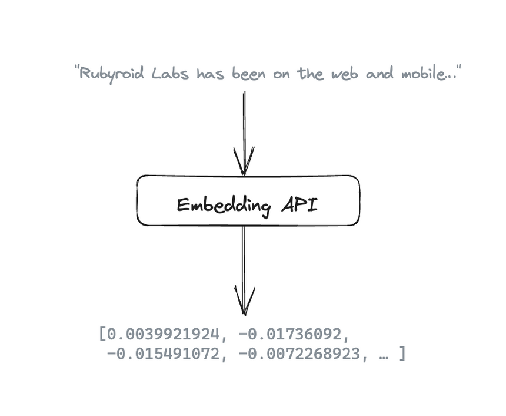
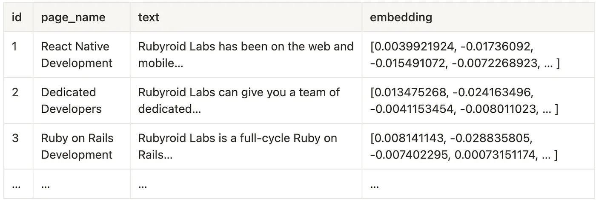

# Embeddings

## Data Chunks

To fit the limits or not spend all budget to 32K requests, let’s provide ChatGPT with the most relevant data. To do so, let’s split all data into small chunks and store it in the PostgreSQL database:


Now, based on the user’s question, we need to find the most relevant chunk in our database. Here Embeddings API can help us. It gets a text and returns a vector (array of 1536 numbers).



Thus, we generate a vector for each chunk via Embeddings API and save it to DB.

```ruby
response = openai_client.embeddings(
  parameters: {
    model: 'text-embedding-ada-002',
    input: 'Rubyroid Labs has been on the web and mobile...'
  }
)

response.dig('data', 0, 'embedding') # [0.0039921924, -0.01736092, -0.015491072, ...]
```

That’s how our database looks now:



**Code:**

```bash
rails g model Item page_name:string text:text embedding:vector{1536}
rails db:migrate
```

Migration:

```ruby
class CreateItems < ActiveRecord::Migration[7.1]
  def change
    create_table :items do |t|
      t.string :page_name
      t.text :text
      t.vector :embedding, limit: 1536

      t.timestamps
    end
  end
end
```

Model:

```ruby
class Item < ApplicationRecord
  has_neighbors :embedding
end
```

Rake task (`lib/tasks/index_data.rake`):

```ruby
DATA = [
  ['React Native Development', 'Rubyroid Labs has been on the web and mobile...'],
  ['Dedicated developers', 'Rubyroid Labs can give you a team of dedicated d...'],
  ['Ruby on Rails development', 'Rubyroid Labs is a full-cycle Ruby on Rails...'],
  # ...
]

desc 'Fills database with data and calculate embeddings for each item.'
task index_data: :environment do
  openai_client = OpenAI::Client.new

  DATA.each do |item|
    page_name, text = item

    response = openai_client.embeddings(
      parameters: {
        model: 'text-embedding-ada-002',
        input: text
      }
    )

    embedding = response.dig('data', 0, 'embedding')

    Item.create!(page_name:, text:, embedding:)

    puts "Data for #{page_name} created!"
  end
end
```

Run rake task:

```bash
rake index_data
```
