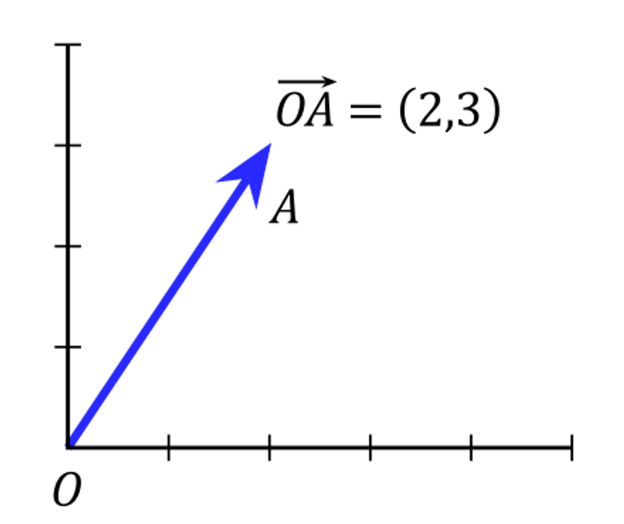
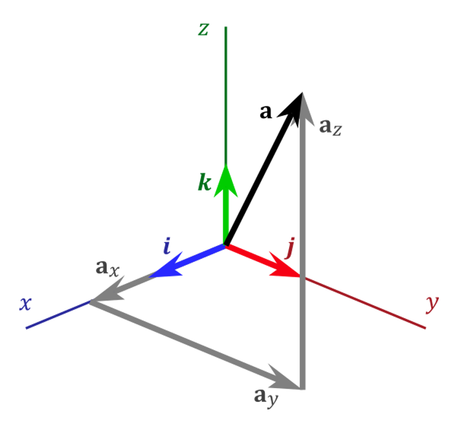
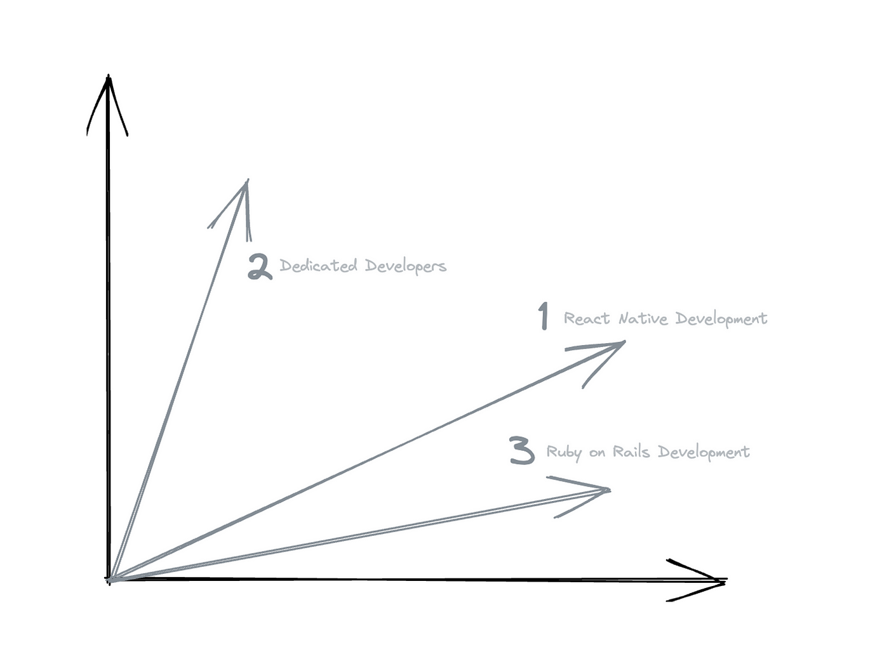
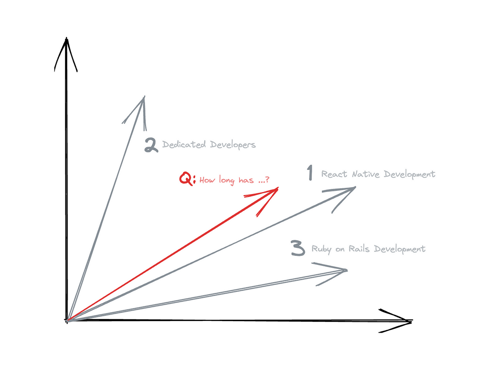
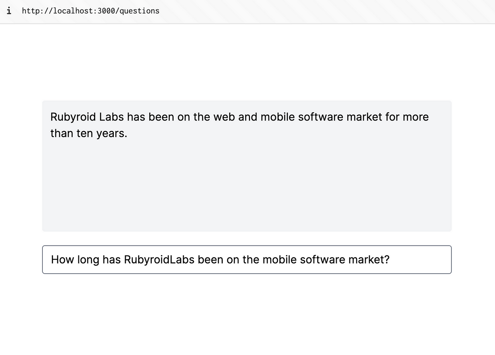
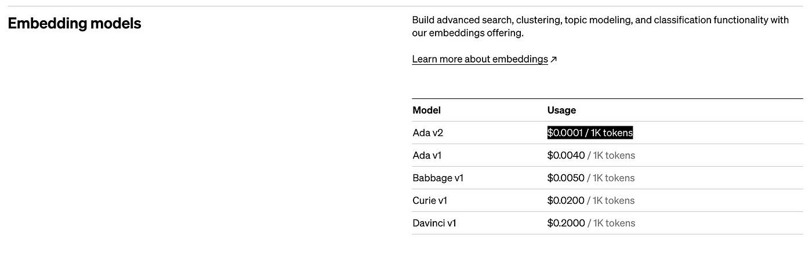

# Embeddings

## Data Chunks

To fit the limits or not spend all budget to 32K requests, let’s provide ChatGPT with the most relevant data. To do so, let’s split all data into small chunks and store it in the PostgreSQL database:


Now, based on the user’s question, we need to find the most relevant chunk in our database. Here Embeddings API can help us. It gets a text and returns a vector (array of 1536 numbers).


Thus, we generate a vector for each chunk via Embeddings API and save it to DB.

```ruby
response = openai_client.embeddings(
  parameters: {
    model: 'text-embedding-ada-002',
    input: 'Rubyroid Labs has been on the web and mobile...'
  }
)

response.dig('data', 0, 'embedding') # [0.0039921924, -0.01736092, -0.015491072, ...]
```

That’s how our database looks now:


**Code:**

```bash
rails g model Item page_name:string text:text embedding:vector{1536}
rails db:migrate
```

Migration:

```ruby
class CreateItems < ActiveRecord::Migration[7.1]
  def change
    create_table :items do |t|
      t.string :page_name
      t.text :text
      t.vector :embedding, limit: 1536

      t.timestamps
    end
  end
end
```

Model:

```ruby
class Item < ApplicationRecord
  has_neighbors :embedding
end
```

Rake task (`lib/tasks/index_data.rake`):

```ruby
DATA = [
  ['React Native Development', 'Rubyroid Labs has been on the web and mobile...'],
  ['Dedicated developers', 'Rubyroid Labs can give you a team of dedicated d...'],
  ['Ruby on Rails development', 'Rubyroid Labs is a full-cycle Ruby on Rails...'],
  # ...
]

desc 'Fills database with data and calculate embeddings for each item.'
task index_data: :environment do
  openai_client = OpenAI::Client.new

  DATA.each do |item|
    page_name, text = item

    response = openai_client.embeddings(
      parameters: {
        model: 'text-embedding-ada-002',
        input: text
      }
    )

    embedding = response.dig('data', 0, 'embedding')

    Item.create!(page_name:, text:, embedding:)

    puts "Data for #{page_name} created!"
  end
end
```

Run rake task:

```bash
rake index_data
```

## Vector

What is a vector? Simply, a [vector](https://en.wikipedia.org/wiki/Vector_(mathematics_and_physics)) is a tuple, or in other words, an array of numbers. For example, `[2, 3]` . In two-dimensional space, it can refer to a dot on the scalar plane:


[2d vector](https://en.wikipedia.org/wiki/Euclidean_vector) on the scalar plane

The same applies to three and more dimensional spaces:



If we had 2d vectors, not 1536d vectors, we could display them on the scalar plane like this:



## How to find the most relevant chunks
So, the app receives the following question: “How long has RubyroidLabs been on the mobile software market?”. Let’s calculate its vector as well.

```ruby
response = openai_client.embeddings(
  parameters: {
    model: 'text-embedding-ada-002',
    input: 'How long has RubyroidLabs been on the mobile software market?'
  }
)

response.dig('data', 0, 'embedding') # [0.009017303, -0.016135506, 0.0013286859, ...]
```

And display it on the scalar plane:



Now we can mathematically find the nearest vectors. No AI is needed for this task. That’s what we previously set up PGVector for.

```ruby
nearest_items = Item.nearest_neighbors(
  :embedding, question_embedding,
  distance: "euclidean"
)
context = nearest_items.first.text
```

And now, just put this context to the Chat API as we already did previously.

```ruby
message_content = <<~CONTENT
  Answer the question based on the context below, and
  if the question can't be answered based on the context,
  say \"I don't know\".

  Context:
  #{context}

  ---

  Question: #{question}
CONTENT

# a call to Chat API
```

Here it is 🎉
- "How long has RubyroidLabs been on the mobile software market?"
- "Does RubyroidLabs do mobile development?"



Our chat answers are based on all the information we provided. Moreover, it almost doesn’t spend additional money per question but provides a better answer. However, you have to pay once for calculating embeddings when initializing the database. For 300K tokens with Ada v2, it [costs](https://openai.com/pricing) just $0.03.



# Summary

Let’s wrap it up:

1. Split the data you have into small chunks. Calculate an embedding for each chunk.
2. Save chunks with corresponding embeddings to a vector DB, e.g., PostgreSQL plus PGVector.
3. The app initialization is done. Now you can receive a question from a user. Calculate embedding for this question.
4. Get a chunk from the DB with the nearest vector to the questions vector.
5. Send a question to Chat API, providing the chunk from the previous step.
6. Get an answer from Chat API and display it to the user 🎉


The complete chat logic extracted to a separate class in `app/services/answer_question_service.rb`:

```ruby
# frozen_string_literal: true

class AnswerQuestionService
  attr_reader :question

  def initialize(question)
    @question = question
  end

  def call
    message_to_chat_api(<<~CONTENT)
      Answer the question based on the context below, and
      if the question can't be answered based on the context,
      say \"I don't know\".

      Context:
      #{context}

      ---

      Question: #{question}
    CONTENT
  end

  private

  def message_to_chat_api(message_content)
    response = openai_client.chat(parameters: {
      model: 'gpt-3.5-turbo',
      messages: [{ role: 'user', content: message_content }],
      temperature: 0.5
    })
    response.dig('choices', 0, 'message', 'content') || response
  end

  def context
    question_embedding = embedding_for(question)
    nearest_items = Item.nearest_neighbors(
      :embedding, question_embedding,
      distance: "euclidean"
    )
    nearest_items.first.text
  end

  def embedding_for(text)
    response = openai_client.embeddings(
      parameters: {
        model: 'text-embedding-ada-002',
        input: text
      }
    )

    response.dig('data', 0, 'embedding')
  end

  def openai_client
    @openai_client ||= OpenAI::Client.new
  end
end

# AnswerQuestionService.new("Yours question..").call

```

What else can be done to improve answers quality:

- **Chunk size.** Find the best size for a data chunk. You can try splitting them into small ones, get the closest N from the database and connect them to one context. Conversely, you can try to create big chunks and retrieve only the one — the closest.
- **Context length.** With `gpt-3.5-turbo` you can send 4,096 tokens. With `gpt-3.5-turbo-16k` - 16,384 tokens. With `gpt-4-32k` up to 32,768 tokens. Find whatever fits your needs.
- **Models.** There are a slew of AI models that you can use for Embeddings or Chat. In this example, we used `gpt-3.5-turbo` for Chat and `text-embedding-ada-002` for Embeddings. You can try different ones.
- **Embeddings.** OpenAI Embeddings API is not the only way to calculate embeddings. There are plenty of other open-source and proprietary models that can calculate embeddings.

#Ruby #Programming #ChatGPT #AI #Chatbots
