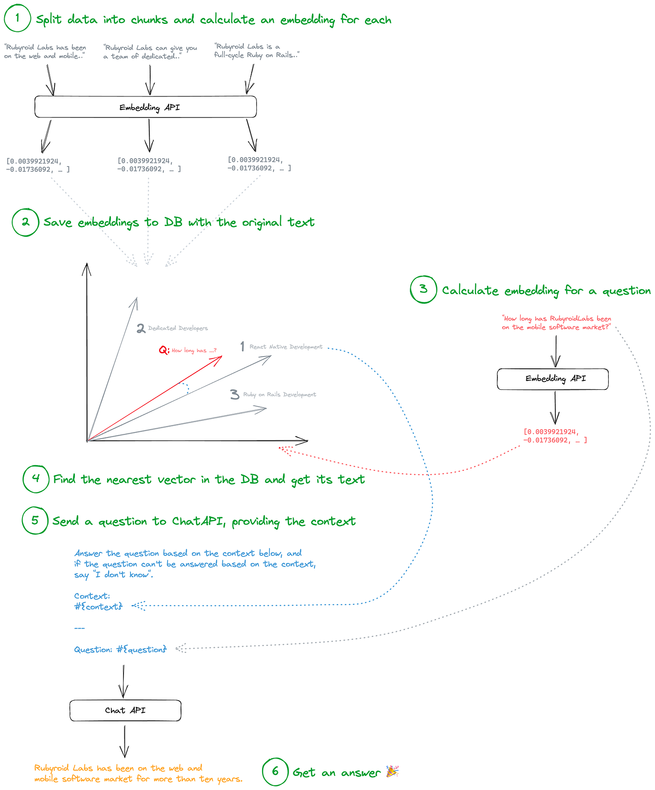

# Summary

Let’s wrap it up:

1. Split the data you have into small chunks. Calculate an embedding for each chunk.
2. Save chunks with corresponding embeddings to a vector DB, e.g., PostgreSQL plus PGVector.
3. The app initialization is done. Now you can receive a question from a user. Calculate embedding for this question.
4. Get a chunk from the DB with the nearest vector to the questions vector.
5. Send a question to Chat API, providing the chunk from the previous step.
6. Get an answer from Chat API and display it to the user 🎉



The complete chat logic extracted to a separate class in `app/services/answer_question_service.rb`:

```ruby
# frozen_string_literal: true

class AnswerQuestionService
  attr_reader :question

  def initialize(question)
    @question = question
  end

  def call
    message_to_chat_api(<<~CONTENT)
      Answer the question based on the context below, and
      if the question can't be answered based on the context,
      say \"I don't know\".

      Context:
      #{context}

      ---

      Question: #{question}
    CONTENT
  end

  private

  def message_to_chat_api(message_content)
    response = openai_client.chat(parameters: {
      model: 'gpt-3.5-turbo',
      messages: [{ role: 'user', content: message_content }],
      temperature: 0.5
    })
    response.dig('choices', 0, 'message', 'content') || response
  end

  def context
    question_embedding = embedding_for(question)
    nearest_items = Item.nearest_neighbors(
      :embedding, question_embedding,
      distance: "euclidean"
    )
    nearest_items.first.text
  end

  def embedding_for(text)
    response = openai_client.embeddings(
      parameters: {
        model: 'text-embedding-ada-002',
        input: text
      }
    )

    response.dig('data', 0, 'embedding')
  end

  def openai_client
    @openai_client ||= OpenAI::Client.new
  end
end

# AnswerQuestionService.new("Yours question..").call

```

What else can be done to improve answers quality:

- **Chunk size.** Find the best size for a data chunk. You can try splitting them into small ones, get the closest N from the database and connect them to one context. Conversely, you can try to create big chunks and retrieve only the one — the closest.
- **Context length.** With `gpt-3.5-turbo` you can send 4,096 tokens. With `gpt-3.5-turbo-16k` - 16,384 tokens. With `gpt-4-32k` up to 32,768 tokens. Find whatever fits your needs.
- **Models.** There are a slew of AI models that you can use for Embeddings or Chat. In this example, we used `gpt-3.5-turbo` for Chat and `text-embedding-ada-002` for Embeddings. You can try different ones.
- **Embeddings.** OpenAI Embeddings API is not the only way to calculate embeddings. There are plenty of other open-source and proprietary models that can calculate embeddings.

#Ruby #Programming #ChatGPT #AI #Chatbots
