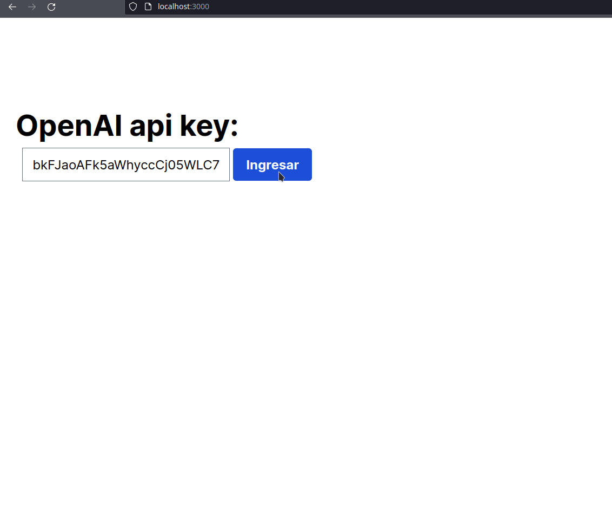

# Creating a chatbot with GPT and Rails.

https://a-chacon.com/en/rails/chatgpt/2023/08/14/chat-rails-chatgpt.html

We will see how to create a custom chat with persistence with Ruby On Rails and ChatGPT. After interacting in a couple of applications with the OpenAi API I want to show how you could make a simple chat that could scale to whatever you want using Ruby On Rails.



Nowadays, interaction with users is crucial to improve online experiences. OpenAI’s ChatGPT is an innovative solution that uses deep learning to create automated conversations that resemble human dialogues. This allows developers to integrate ChatGPT’s artificial intelligence into various applications, providing more natural interaction with users. To streamline web application development, Ruby on Rails (known as Rails) stands out as a reliable and efficient framework. Rails, based on Ruby, simplifies the creation and maintenance of web applications by providing a robust framework and pre-built tools, making it the preferred choice of many developers for building robust and scalable web applications.

## Creating our Rails application.

/!\ Skipping this part • Already done previously

The application will be a simple sample of what can be done by integrating with ChatGPT. The model will be something basic where we will store an OpenAI token or Api key that will have conversations and these in turn will have messages. and these in turn will have messages.

Create the Ruby On Rails application, in my case I used the name `minichat`, you can use the name you want:

```bash
rails new minichat --css tailwind
```

To interact with the OpenAI API we will use the `ruby-openai` gem. So we add it to our Gemfile:

```ruby
gem "ruby-openai"
```

And then we run `bundle install`.

## Models

As I said at the beginning our application will be based on 3 simple models. The `token` model, which will store an OpenAI api token and will be used as authentication both in the app and to interact with the OpenAI API. Then we will have the `Conversation` model that will store the configurations of each conversation. And finally our `M̀essage` model that will represent a message, either system, user or wizard.

We create our models with the following instructions:

```bash
rails g model token token:string
rails g model conversation temperature:float init_system_message:text model:string token:belongs_to
rails g model message content:text role:integer conversation:belongs_to
```

We run the migrations with the `rails db:migrate` command.

And we complete the code of our models. They should look like this:

```ruby
# app/models/token.rb

class Token < ApplicationRecord
  has_many :conversations
  validates :token, presence: true
end
```

```ruby
# app/models/conversation.rb

class Conversation < ApplicationRecord
  belongs_to :token
  has_many :messages

  after_create :create_system_message

  private

  def create_system_message
    return if init_system_message.empty?

    messages.create(role: 'system', content: init_system_message)
  end
end
```

```ruby
# app/models/message.rb

class Message < ApplicationRecord
  belongs_to :conversation
  enum :role, %i[system user assistant], default: :user

  after_create_commit lambda {
                        broadcast_append_to 'messages', partial: 'messages/message', locals: { message: self },
                                                        target: 'messages'
                      }
  after_create :generate_ai_response

  private

  def generate_ai_response
    return if role != 'user'

    response = chat(messages: conversation.messages.map { |m| { role: m.role, content: m.content } })
    conversation.messages << Message.create(role: 'assistant', content: response)
  end

  def chat(model: 'gpt-3.5-turbo', messages: [])
    client = OpenAI::Client.new(access_token: conversation.token.token)

    response = client.chat(
      parameters: {
        model:, # Required.
        messages:, # Required.
        temperature: conversation.temperature
      }
    )

    response.dig('choices', 0, 'message', 'content')
  end
end
```

The latter is where the interaction with ChatGPT takes place and which I will explain in more detail.

### Message Model and ChatGPT

The message model performs two important actions:

1. Transmit a partial view of itself to any active conversation in which it should appear. This is done in order not to have to reload the chat every time there is a new message.
```ruby
after_create_commit lambda {
                     broadcast_append_to 'messages', partial: 'messages/message', locals: { message: self },
                                                     target: 'messages'
                   }
```

2. If the last message created was by the user, then ChatGPT must generate a response which is nothing more than a new message taking into account the detail that ChatGPT `has no memory`. So every time we need to generate a new reply we must send the whole conversation:

```ruby
...
after_create :generate_ai_response
...
# Here we get the whole conversation and send it as an array in messages.
response = chat(messages: conversation.messages.map { |m| { role: m.role, content: m.content } })
...
```

## Controllers

We will need a couple of actions on our models, so we will create 3 controllers with their corresponding views:

```bash
rails g controller tokens new create
rails g controller conversations new create index show
rails g controller messages create
```

We will start with our authorization method. If we don’t have API Key then we don’t continue, for that we define a function that is available for all our controllers:

```ruby
# app/controller/application_controller.rb

class ApplicationController < ActionController::Base
  def authorize!
    if session[:token]
      @token = Token.find_by(token: session[:token])
    else
      redirect_to root_url
    end
  end
end
```

Then our other controllers should look like this:
```ruby
# app/controllers/tokens_controller.rb

class TokensController < ApplicationController
  def new
    @token = Token.new
  end

  def create
    @token = Token.find_or_create_by(token: params['token']['token'])
    session[:token] = @token.token

    redirect_to conversations_url
  end
end
```

```ruby
# app/controller/conversations_controller.rb

class ConversationsController < ApplicationController
  before_action :authorize!

  def new
    @conversation = Conversation.new
  end

  def create
    @conversation = Conversation.new(conversation_params)
    @conversation.token = @token

    if @conversation.save!
      redirect_to conversation_url(@conversation)
    end
  end

  def index
    @conversations = @token.conversations
  end

  def show
    @conversation = Conversation.find(params[:id])
  end

  private

  def conversation_params
    params.fetch(:conversation, {}).permit(:temperature, :init_system_message)
  end
end
```

```ruby
# app/controller/messages_controller.rb

class MessagesController < ApplicationController
  def create
    @conversation = Conversation.find(params[:conversation_id])
    @message = @conversation.messages.create(message_params)
  end

  private

  def message_params
    params.require(:message).permit(:content)
  end
end
```

## Views

Finally I will leave the code of the views:

### Tokens

```ruby
# app/views/tokens/new.html.erb
<div>
  <h1 class="font-bold text-4xl">OpenAI api key:</h1>
  <div class="p-2">
  <%= form_with model: @token do |form| %>
    <%= form.text_field :token %>
    <%= form.submit "Submit", class: "bg-blue-500 hover:bg-blue-700 text-white font-bold py-2 px-4 rounded" %>
  <% end %>
  </div>
</div>
```

### Conversations

```ruby
# app/views/conversations/index.html.erb

<div>
  <div class="flex">
    <h1 class="font-bold text-4xl pr-2">Conversations</h1>
    <a href="<%= new_conversation_path %>" class="bg-blue-500 hover:bg-blue-700 text-white font-bold py-2 px-4 rounded">New</a>
  </div>
  <ul class="list-disc p-4">
    <% @conversations.each do |c| %>
      <li class="pb-2"><a href="<%= conversation_url(c) %>"><%= c.id %> - <%= c.init_system_message[0..40]%>...</a></li>
    <% end %>
    <% if @conversations.empty? %>
      <span class="text-xl my-4">No conversations yet</span>
    <% end %>
  </ul>
</div>
```

```ruby
# app/views/conversations/new.html.erb

<div>
  <h1 class="font-bold text-4xl">New Conversation</h1>
  <%= form_with model: @conversation, class: "grid grid-cols-2 gap-4" do |form| %>
    <%= form.label :temperature, "Model temperature:" %>
    <%= form.number_field :temperature, value: 0.5, in: (0.0)..(1.0), step: 0.1, value: 0.5 %>

    <%= form.label :init_system_message, "Initial message (Prompt):" %>
    <%= form.text_area :init_system_message %>
    <%= form.submit "Create", class: "bg-blue-500 hover:bg-blue-700 text-white font-bold py-2 px-4 rounded" %>
  <% end %>
</div>
```

```ruby
# app/views/conversations/show.html.erb

<div>
  <h1 class="font-bold text-4xl"><a href="<%= conversations_path %>" class="text-blue-600 hover:text-blue-300" >Conversations</a> # <%= @conversation.id %></h1>

  <div>
    <div id="chat-messages" class="w-6/12">
      <%= turbo_stream_from "messages" %>
      <%= turbo_frame_tag "messages" do %>
        <%= render @conversation.messages %>
      <% end %>
    </div>

    <%= form_with(model: [@conversation, Message.new], remote: true) do |form| %>
      <%= form.text_field :content, class: "w-96 rounded-lg" %>
      <%= form.submit "Send", class: "bg-blue-500 hover:bg-blue-700 text-white font-bold py-2 px-4 rounded" %>
    <% end %>
  </div>
</div>
```

### Messages

The only special thing about this view will be that it will differentiate messages by role with different colors.

```ruby
# app/views/messages/_message.html.erb

<div class="my-1">
  <% if message.role == "user" %>
    <div class="bg-blue-500 rounded-lg">
  <% elsif message.role == "assistant" %>
    <div class="bg-emerald-500 rounded-lg">
  <% elsif message.role == "system" %>
    <div class="bg-neutral-700 rounded-lg">
  <% end %>
      <p class="p-2 text-white"><%= message.content %></p>
    </div>
</div>
```

## Routes

We will configure our `routes.rb` file as follows:
```ruby
Rails.application.routes.draw do
  resources :tokens, only: [:create]
  resources :conversations, only: [:new, :create, :index, :show] do
    resources :messages, only: [:create]
  end

  root 'tokens#new'
end
```

## And we test our application.

We pull up our server with `bin/dev` to get tailwindcss working and we should be able to do a flow like the following:


# Conclusion.

After having realized a couple of applications in this way I would like to highlight two important points that could be useful for anyone who is going to develop a chatbot with Ruby on Rails and ChatGPT:

1. **Conversation persistence**: It is essential to keep in mind that ChatGPT has no long term memory. This means that every time you want to continue a conversation, you will have to provide all the previous conversation in the request, since the model does not retain information. The responsibility of managing and maintaining the persistence of the conversation falls on us as developers.
2. **System messages**: These messages allow you to upload information and provide clear instructions to ChatGPT during the conversation. This is especially useful for guiding the flow of the conversation and ensuring that the chatbot understands the context and intentions of the user.

When you sign up you get $5 credit, which gives you for several conversations. So you can start your trial and error journey.
