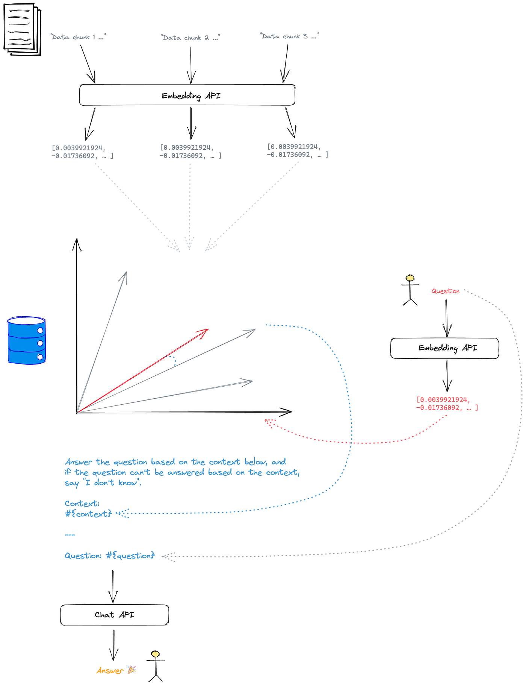

# How to build an AI chatbot with Ruby on Rails and ChatGPT

https://medium.com/@rubyroidlabs/how-to-build-an-ai-chatbot-with-ruby-on-rails-and-chatgpt-9a48f292c37c

# Table of Contents

- Setup
    — Initialize Ruby on Rails project with PostgreSQL
    — Setup PGVector
    — Setup OpenAI
    — Build a simple chat with Hotwired

- Prototype
    — Chat API
    — Deal-breaker

- Embeddings
    — Data Chunks
    — Vector
    — How to find the most relevant chunks

- Summary

# Introduction

In today’s fast-paced world, businesses are confronted with the daunting task of delivering accurate and prompt responses to user inquiries. Whether it’s assisting customers, sharing technical documentation, or simply exchanging knowledge, the need for a dependable and efficient system to address user questions has become absolutely vital. And that’s where the incredible power of an AI chatbot, fueled by a specialized knowledge base, comes into play.

An AI chatbot that can answer questions based on a specific knowledge base is a valuable asset for organizations looking to automate customer interactions and improve overall user experiences. Unlike more general-purpose chatbots, these knowledge-based chatbots are designed to provide precise and contextually relevant responses by leveraging a curated knowledge base of information.

The beauty of this approach lies in the ability to tailor the chatbot’s responses to a specific domain or topic. By creating a knowledge base that encompasses relevant information about products, services, policies, or any other subject, the chatbot becomes an invaluable resource for users seeking specific information.

Use-cases for such knowledge-based chatbots are plentiful. For instance, an e-commerce company can build a chatbot that assists customers with product inquiries, availability, and shipping details. Similarly, educational institutions can employ chatbots to answer frequently asked questions about courses, admissions, and campus facilities. In addition, there are many other cases, some of which are listed in our other [blog post](https://rubyroidlabs.com/blog/2023/04/how-to-use-chatgpt-api/).

In our case, we were asked to develop a chatbot for legal consulting. Therefore, it should base its answers only on the provided knowledgebase, and the answers should be very specific. The knowledgebase consists of 1 billion words. We faced many challenges, and with this article we will show you how we solved them.

Throughout this article, we’ll guide you through the process of setting up a Ruby on Rails project, integrating ChatGPT, and building the functionality to retrieve and utilize the knowledgebase to answer user questions. By the end, you’ll have the necessary skills to develop your own knowledge-based chatbot tailored to your organization’s specific domain or topic that empowers users to obtain precise and relevant answers based on the specific knowledgebase you provide.

For the sake of this example, we are going to embed information from the [RubyroidLabs website](https://rubyroidlabs.com/), thereby the AI chatbot can answer questions about the company.

There is what we are going to build:

Let’s get to this solution step by step.
